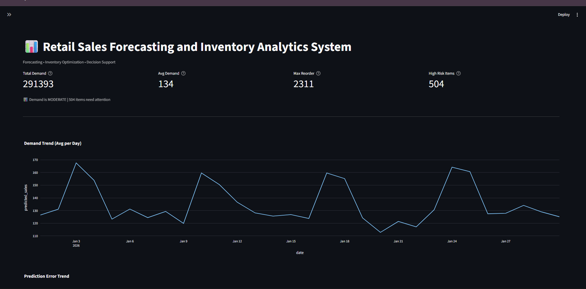
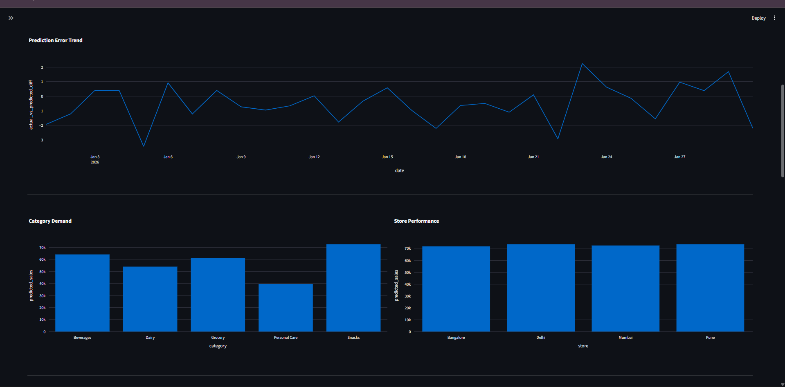
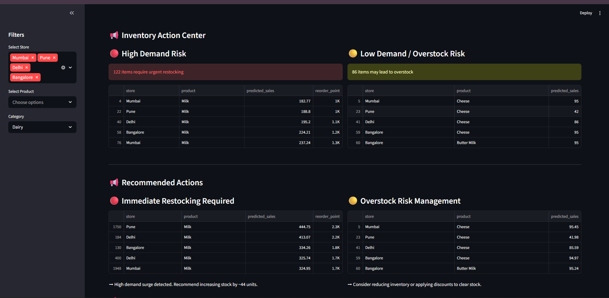
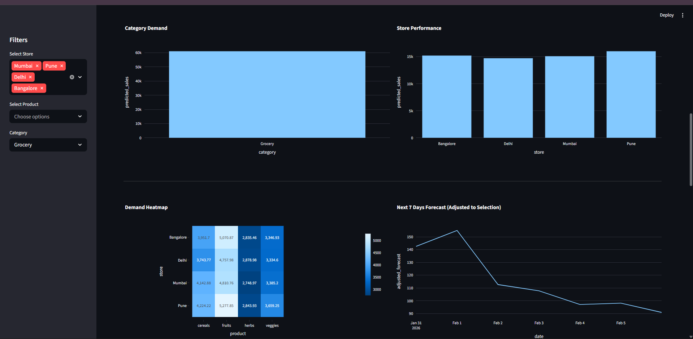
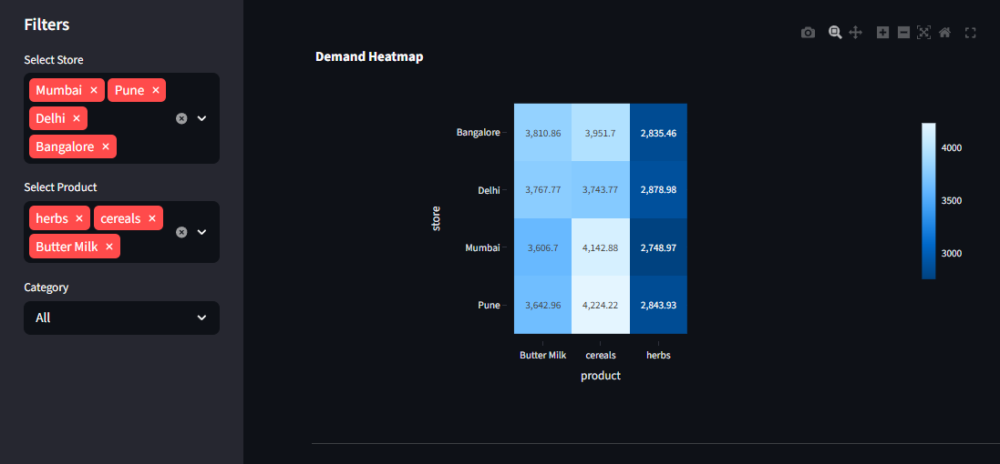
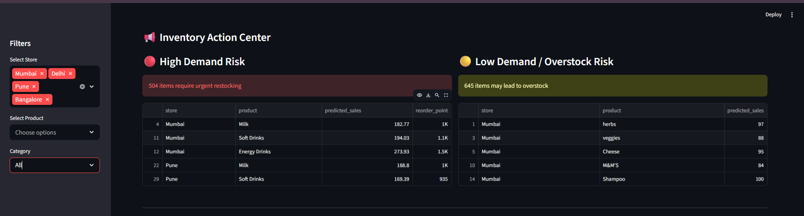
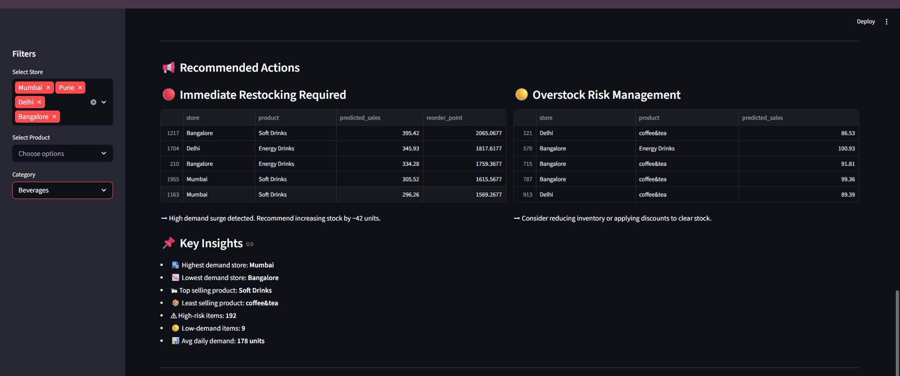
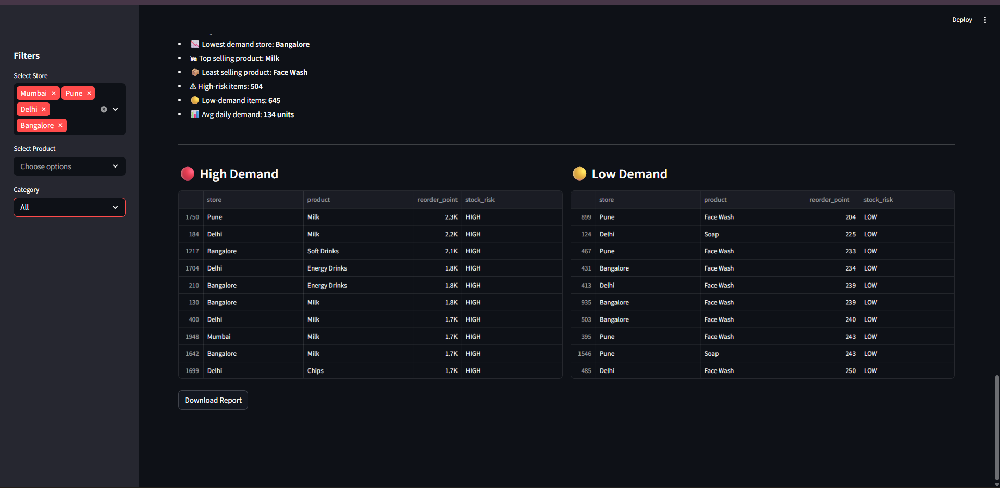

# 📊 Data-Driven Retail sales Forecasting & Inventory Optimization Dashboard

A comprehensive data science project that analyzes retail sales data, forecasts demand using machine learning, and provides actionable inventory insights through an interactive dashboard.

---

## 🚀 Overview

This project simulates a real-world retail environment and builds an end-to-end pipeline for:

- 📈 Demand Forecasting using Machine Learning
- 📦 Inventory Optimization (Reorder Points, Safety Stock)
- 📊 Interactive Data Visualization Dashboard
- 📌 Business Insights & Decision Support

---

## 🧠 Key Features

- ✔ Data-driven demand forecasting using Random Forest Regressor  
- ✔ Feature engineering with time-based variables  
- ✔ Inventory planning (safety stock & reorder points)  
- ✔ Risk categorization (High / Normal / Low demand)  
- ✔ Actionable recommendations for inventory decisions  
- ✔ Interactive dashboard with filters (Store, Product, Category)  
- ✔ Future demand prediction (next 7 days)  
- ✔ Advanced visualizations (heatmaps, trends, comparisons)  

---

## 🛠 Tech Stack

- **Python**
- **Pandas, NumPy**
- **Scikit-learn (ML Model)**
- **Plotly (Interactive Charts)**
- **Streamlit (Dashboard UI)**

---

## 📂 Project Structure

Retail-Forecasting-System/
│
├── app/ # Streamlit dashboard
├── src/ # Core logic (ML, preprocessing, etc.)
├── data/ # Raw dataset
├── outputs/ # Generated results
├── screenshots/ # Dashboard images
├── main.py # Pipeline execution
├── requirements.txt
└── README.md

---

## 📸 Dashboard Screenshots

### 🔹 Dashboard Overview

### 🔹 forecasting

### 🔹 analysis Sales

### 🔹 Demand Heatmap

### 🔹 Inventory and Actions

### 🔹 conclusion downloads

---

## ⚙️ How to Run

### 1. Clone repository

git clone 

cd Retail-Forecasting-System

### 2. Create virtual environment

python -m venv venv
venv\Scripts\activate # Windows

### 3. Install dependencies

pip install -r requirements.txt

### 4. Run pipeline

python src/data_generator.py
python main.py

### 5. Launch dashboard

streamlit run app/app.py

---

## 📌 Key Insights

- Identifies high-demand products requiring immediate restocking  
- Detects low-demand items that may lead to overstock  
- Provides store-wise and category-wise performance analysis  
- Enables decision-making through interactive filtering  

---

## 🎯 Future Improvements

- Add time-series models (ARIMA / Prophet)  
- Integrate real-time data pipeline  
- Deploy dashboard online  
- Add database integration  

